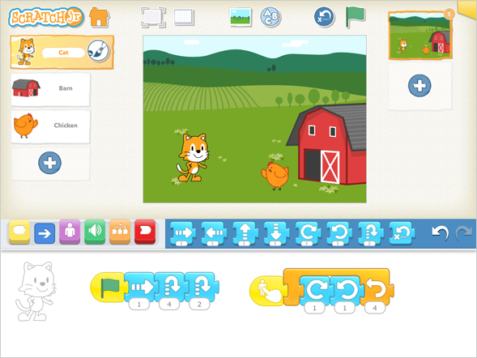

footer: [UoN CS4S Introduction 2019 Workshop](http://cs4s.github.io/intro-2019)

# From Unplugged to Blocks

## Coding & STEM 4 Schools

### An Introduction to Coding and Computational Thinking

#### Presented by Mr Daniel Hickmott

###### October 10th 2019

---

# Recap of Last Session

- In the Unplugged session you learned about some **computational concepts**:
    - *Sequences*
    - *Loops*
- In this session, you will apply these concepts to solve *Coding Puzzles*
- You will also learn about another concept: *Events*

---

# Session Overview

- We will explain what *Block Coding* is
- Share and try out a variety of free *Coding Puzzles* resources:
    - [Lightbot](http://lightbot.com/flash.html)
    - [Code.org Activities](https://code.org/learn)
    - [Scratch DebugIt Projects](https://scratch.mit.edu/studios/475483/projects/)
- Discuss some other resources for teaching Coding with *Puzzles*

---

# Coding with Blocks Languages

- Blocks are a common way of introducing Coding to students
- Involve dragging and dropping blocks together to build *Scripts*
- Also referred to as *Visual Programming Languages*
- [Scratch](https://scratch.mit.edu/), [Lego Mindstorms](https://www.lego.com/en-us/mindstorms/about-ev3) and [Snap!](https://snap.berkeley.edu/) are examples of *Blocks Languages*

---

# Text vs Blocks

---

# Blocks Coding in Education

- [Scratch](https://scratch.mit.edu/) is commonly used in K-6
- [Snap!](https://snap.berkeley.edu/) (an extension of Scratch) has been used for [High School](https://bjc.berkeley.edu/ap-cs-principles/) and [University courses](http://cs10.org/su18/) in the USA
- *Blocks Coding* could be easier to learn than in *Text*
- Prevent problems caused by spelling or syntax errors
- Students can focus on learning the concepts instead of being overloaded by remembering commands

---

# Blocks Coding in Education

- *Blocks Coding* languages vary in complexity
- Will be suitable to different students' age groups
- *Symbols* for younger students (Early Stages - Stage 2), for example: [ScratchJr](https://www.scratchjr.org/) 
- *Commands in Blocks* for students from Stage 2 upwards, for example: [Scratch](https://scratch.mit.edu/)
- *Hybrid* for students moving from *Blocks* to *Text* Coding, for example: [PencilCode](http://pencilcode.net/) for Years 7-8

---

# Blocks Languages: Symbols[^ ] for Early Stages

[^ ]: Image from: [https://www.scratchjr.org/learn/interface](https://www.scratchjr.org/learn/interface)

---

# Blocks Languages: Commands in Blocks for Stage 2+

---

# Blocks Languages: Mixing Blocks and Text for Years 7+

---

# Syllabus Outcomes: Stages 1 - 3

- New Science & Technology K-6 Syllabus:
	- *ST1-3DP-T:* describes, follows and represents *algorithms* to solve problems
	- *ST2-3DP-T:* defines problems, describes and follows *algorithms* to develop solutions
	- *ST3-3DP-T:* defines problems, and designs, modifies and follows *algorithms* to develop solutions

---

# Syllabus Outcomes: Stage 4 & Cross-Curricular

- New Technology Mandatory (7-8) Syllabus:
	- *TE4-4DP:* designs *algorithms* for digital solutions and implements them in a general-purpose programming language

- *Puzzles* also involve elements within the *Numeracy General Capability* as there's often counting and spatial reasoning involved when solving the *Puzzles*

---

# Puzzles for Teaching Coding

- A common way of teaching Coding (particularly with *Blocks languages*)
- We will look at a few different resources for teaching Coding with *Puzzles* in this session
- Help your students think about *sequences* of instructions and how Computers follow these
- Practice their *algorithmic thinking*: solving problems through step-by-step instructions

---

# Coding Puzzles for High School Students

- The resources in this session may be more suitable for K-6 students or those new to Coding
- There are *Puzzle* resources for learning Coding that are more difficult & involve *Text Coding*, for example:
	- [Code Combat](https://codecombat.com/): a game for learning JavaScript
	- [Swift Playgrounds](https://www.apple.com/au/swift/playgrounds/): iPad app for learning Swift
	- [Project Euler](https://projecteuler.net/): problems that can be solved with Coding and Mathematics (can be quite difficult)

---

# Lightbot

- An example of a *Puzzle* game for learning Coding
- Involves solving problems with *Sequences* and *Loops*
- A link to the site is under the *Activities* heading
- Also available on *Android* and *iOS* for a small price
- The goal is to instruct the Lightbot character to light up all of the blue squares with *algorithmic thinking*

---

# Lightbot[^  ]

Try to solve some different puzzles in Lightbot

[^  ]: Image from: [http://lightbot.com/flash.html](http://lightbot.com/flash.html)

---

# Lightbot: Discussion

- Why were *Sequences* important when playing Lightbot?
- Did anyone try the *Procedures* activities?
- Did anyone use *Loops*?

---

# Code.org

- Has anyone run an *Hour of Code* with their students?
- An initiative created by the [Code.org](https://code.org/) organisation (based in USA)
- [Code.org](https://code.org/) does a lot of work in:
    - Developing their own resources and curriculum
    - Collating existing resources
    - Helping prepare teachers for teaching Coding

---

# Code.org's Hour of Code

- [Code.org](https://code.org/) has several *Coding Puzzle* resources
- Some examples with different themes:
    - [Star Wars](https://code.org/starwars)
    - [Frozen](https://code.org/frozen)
    - [Minecraft](https://code.org/minecraft)
- Blocks have a command written on them (for example, *move up*, instead of an arrow symbol like in Lightbot)

---

# Code.org's Hour of Code

- Choose one of the themed Hour of Code activities (*Star Wars*, *Frozen* or *Minecraft*) and try the activities
- The [Star Wars](https://code.org/starwars) activity could be useful for introducing *Text Coding*, as it allows you to switch between blocks and text, if you select the *JavaScript* option
- If you have already done these activities already, try one of the other resources available from the [Learn](https://studio.code.org/courses) page or let us know what we suggest you try next

---

# Code.org's Hour of Code: Discussion

- Were the *Puzzles* that you solved similar to those in Lightbot?
    - Did you use *Sequencing* and *Loops*?
- Did you try a different Code.org resource?
- How was it different to the Star Wars, Frozen and Minecraft activities?

---

# Puzzles in Scratch

- Next, we will look at [Scratch](https://scratch.mit.edu/)
- The real strength of [Scratch](https://scratch.mit.edu/) is for the creation of *Projects* (such as *Stories*, *Animations* and *Games*)
- However, there is a collection of Scratch *Puzzles* called *DebugIt* activities
- These *DebugIt* activities involve identifying and fixing a problem in a Scratch project (*debugging*)
- We will look at the [DebugIt 1.1 Project](https://scratch.mit.edu/projects/10437040/) now

---

# Debugging

- The [DebugIt 1.1 Project](https://scratch.mit.edu/projects/10437040/) has two *Sprites* (Characters)
- When we click the *green flag*, the Cat does a dance
- The *when green flag clicked* block is an example of an *Event*
- Gobo should start dancing when the *green flag* is clicked, why doesn't he?
- There are many more *Debug It!* activities, which are from the *Creative Computing Curriculum Guide*

---

# Next Session

- You will learn about the *Creative Computing Curriculum Guide*
- A guide for teaching Coding in [Scratch](https://scratch.mit.edu/) but that could be adapted for other languages
- Encourages an approach to learning Coding that emphasises creativity and the creation of *Projects*
