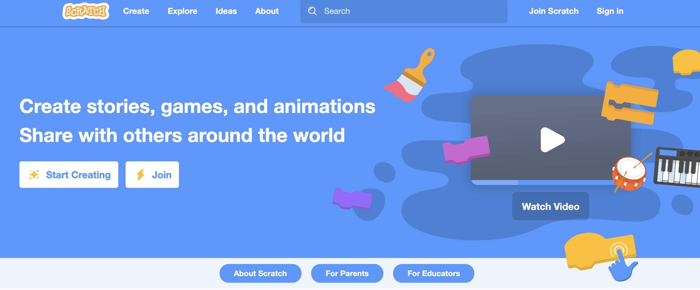
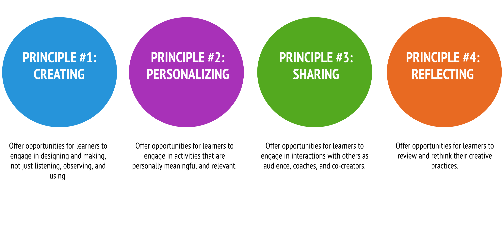
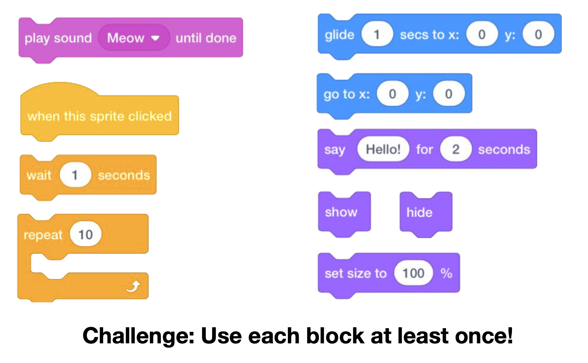

footer: [UoN CS4S Introduction 2019 Workshop](http://cs4s.github.io/intro-2019)

# Creative Computing with Scratch

## Coding & STEM 4 Schools

### An Introduction to Coding and Computational Thinking

#### Presented by Mr Daniel Hickmott

###### October 10th 2019

---

# Recap of Last Session

- In the last session you:
	- learned about *Coding Puzzles* (such as [Lightbot](http://lightbot.com/))
	- created *algorithms* (step-by-step instructions) with *Blocks Coding* to solve *Puzzles*
- You also applied essential **Computational Concepts**:
	- *Sequences*
	- *Loops*
	- *Events* 

---

# Session Overview

- You will learn: 
	- about [Scratch](https://scratch.mit.edu/), a *Blocks Coding language* and community
	- how [Scratch](https://scratch.mit.edu/) can be used to create projects that address outcomes from a variety of KLAs
	- about some high-quality resources for teaching Coding in [Scratch](https://scratch.mit.edu/), including the *Creative Computing Curriculum Guide*

---

# Puzzles and Projects

- The creators of [Scratch](https://scratch.mit.edu/) are sceptical of only using *Puzzles* for teaching Coding
- *"This approach [teaching with Puzzles] can help students learn some basic coding concepts, but it doesn’t allow them to express themselves creatively — or develop a long-term engagement with coding."[^1]*
- *"It’s like offering a writing class that teaches only grammar and punctuation without providing students a chance to write their own stories."[^1]*

[^1]: [A Different Approach to Coding by Mitchel Resnick & David Siegel](https://brightthemag.com/a-different-approach-to-coding-d679b06d83a)

---

# Scratch

- The Scratch creators emphasise Coding for personal and creative expression, not just as a job skill
- *"With Scratch, our goal is for young people to become fluent with coding — not only learning the mechanics and concepts of coding, but also developing their own voice and their ability to express their ideas."[^1]*
- This argument is applicable to the teaching and learning of Coding in general, not just in [Scratch](https://scratch.mit.edu/)

[^1]: [A Different Approach to Coding by Mitchel Resnick & David Siegel](https://brightthemag.com/a-different-approach-to-coding-d679b06d83a)

---

# Scratch

- A free Coding tool created and maintained by the [Lifelong Kindergarten Group](https://www.media.mit.edu/groups/lifelong-kindergarten/overview/) at the [MIT Media Lab](https://www.media.mit.edu/)
- Designed to have:
	- *Low floor*
	- *Wide walls*
	- *High ceiling*
- Moderated community

---

# Offline vs Online Version

- Online version of Scratch has three main advantages:
	- the Community (millions of members & projects)
	- *Teacher Accounts*
	- You don't need to install anything on school PCs
- Offline version may be better suited to schools with unreliable or slow internet connections
- **We will focus on the online version in this workshop**

---

# The Website

- [scratch.mit.edu](https://scratch.mit.edu/) (link is also on the session web page)

---

# The Website

- *Try it Out* / *Create*
- *See Examples* / *Explore*
- *Featured Projects*
- *Join Scratch*

---

# Type of Accounts

- *Normal Account*
- *Student Accounts*
- *Teacher Accounts*

---

# Sign In

- I have emailed you the details of a *Student Account*
- Will be similar to *SilverWombat_CS4S* + a password
- You may already have your own *Normal* or *Teacher Account* - you can use that account instead
- Once you have signed in, click the *Create* button at the top of the [Scratch](https://scratch.mit.edu/) website
- This will take you to the *Editor View*

---

# Editor: Palettes and Panes

- **Block Palette:**
	- *Scripts* tab
	- Blocks are grouped by functionality
	- Colours indicate the type of block (for example: all *motion* blocks are blue) 

---

# Editor: Palettes and Panes

- **Scripts Area**
	- This is where blocks are placed to create *scripts*
	- Each *Sprite* has a different *Scripts Area*
- **Sprites Pane**
	- Different ways to add *Sprites*
	- Blue highlight = *Sprite* is selected 

---

# Editor: Palettes and Panes

- **Costume Pane**
	-  Also referred to as the *Costume* tab
	-  Each *Sprite* can have 1 or more *Costumes*
- **Sounds Pane**
	- A list of audio clips for the *Sprite*
	- Could be sound effects (for example: a dog barking) or background music

---

# Editor: Stage

- Also referred to as the *Canvas*
- Has two buttons:
	- *Green Flag*
	- *Stop Sign*
- Has its own *Script* area 
	- Blocks available to *Stage* differ to those available for *Sprites*
	
---

# Editor: Toolbar

- There is a *Toolbar* at the top of the *Scratch* editor

- A couple of examples that will be useful for this workshop:
	- *File > Load from your computer*
	- *Edit > Restore*

---

# Getting Started Activity

- We have an activity on the session web page called *Getting Started with Scratch*
- This activity involves trying out some of the different Scratch blocks and seeing (and hearing) what they do
- If you have already tried this activity or complete it quickly, have a look at some of the links under the *Other Scratch Resources* on the session page

---

# Creative Computing Curriculum Guide

- Next, you will learn about the [Creative Computing Curriculum Guide](http://scratched.gse.harvard.edu/guide/)
- A guide for teaching Coding with an emphasis on *Creative Computing*
- Created by researchers and educators from the [Harvard Graduate School of Education](https://www.gse.harvard.edu/)
- Also developed in collaboration with members of the [ScratchEd](http://scratched.gse.harvard.edu/) community

---

# Creative Computing Curriculum Guide

- Includes *activities*, *starter projects* and *Debug It!* projects
- Encourages learners to be *creators and designers with digital technologies*, rather than "consumers"
- Emphasises creativity and the creation of personally meaningful projects
- Activities designed to encourage exploration of Scratch and balance this with guidance

---

---

# The 7 Units

- Themed Units (for example, Unit 2 focuses on *Stories*)
- Each Unit usually has a *Big Idea*, 6 activities within it and a *Debug-It Studio*
- Activities could be linked to different KLA outcomes
- Unit 3 (*Stories*) could be linked to English through *Digital Storytelling*
- Unit 4 (*Games*) could be linked to Mathematics through *Game Design*

---

# Today's Activities

- Today we will work on different activies adapted and inspired by activities from the guide:
	- *Unit 1 (Exploring)*
	- *Unit 2 (Animations)*
- Both of the full units are linked on the session page, under *The Creative Computing Guide* heading
- We will only have a chance to look at a couple of activities today but encourage you to try more

---

# Unit 1’s Big Idea

- *"...educators sometimes worry that they don’t “know” enough about Scratch to be able to help others. We encourage you to take a broad view of what it means to 'know' Scratch."*
- *"You don’t need to know everything about the Scratch interface or how to solve every problem that a learner encounters."* 
- *"But, ...educators can serve as cognitive guides, asking questions and helping break down problems into manageable pieces."*

---

# 10 Blocks

- An example of an activity where guidance and exploration are balanced
- You only have to know about 10 [Scratch](https://scratch.mit.edu/) blocks
- Go to *Create* or *File > New* to create new Scratch project
- Change the project name to "10 Blocks"
- Share and add it to the "10 Blocks" *Class Studio*

---

---

# 10 Blocks Discussion

- What did you notice about the blocks' colours?
- Did you accidentally hide your *Sprite* and have trouble getting it to appear again?
- Did you make any other changes to your project (for example, changing the Sprite's costume?)
- What did the *repeat* block do?
- Which of the blocks is an example of an *Events* block?

---

# Interesting Projects

- As of July 2018, *Scratch* has *29,196,391* members and *36,965,357* projects
- You can search all projects and see **the Code in them**
- You can also take a copy by *remixing*
- Have a look for some interesting projects (through *Explore* or the *Search box*)
- After 5 or so minutes, choose your favourite project and add it to the "Interesting Projects" *Class Studio*

---

# Remixing

- In *Scratch* you can take a copy of all of the *Sprites*, *Scripts* and *Sounds* of **any shared Project**
- When you take a copy of a project and change it, you are *Remixing* (a **Computational Practice**)
- This feature is very useful but could lead to issues around plagiarism
- Similarly, the [backpack feature](https://en.scratch-wiki.info/wiki/Backpack) allows you to drag *Sprites*, *Scripts* and *Sounds* between projects

# Remixing Activity

- We have created a *Class Studio* with some projects that you can *remix*
- [Remix Activity Class Studio](https://scratch.mit.edu/studios/5225358/) link under *Activities*
- Choose a project to *remix* (you can only *remix* from the *Editor View*, where all the blocks are)
- Make three or more changes to the project (for example: adding a *Sprite*, changing the *Backdrop* or adding *Sound* effects)

---

# Remixing Activity Discussion

- What changes did you make to the *remixed* project?
- Do you understand what the blocks in the original project do?
- Did you upload or create your own *Sprites*, *Sounds* or *Backdrops*?
- Did you use the *backpack* to copy blocks from other projects to your *remix*?

---

# Debug It!

- In the last session we looked at *Debug It!* projects
- These projects were created as part of the *Creative Computing Curriculum Guide*
- There is a *Debug It! Studio* for every Unit of the guide
- For example, studios for the [Stories](https://scratch.mit.edu/studios/475554/) and [Games](https://scratch.mit.edu/studios/475634/) units
- Try to solve the other [Unit 1 Debug It activities](https://scratch.mit.edu/studios/475483/projects/) and we will show you some ways of solving these as well

---

# Performing Scripts

- Activity adapted from *Unit 2 (Animations)*
- Coding in Scratch is like directing theatre
- We have characters (*Sprites*), *Costumes*, *Backdrops*, *Scripts* and a *Stage*
- We have *Events* that trigger certain actions (like the green flag)
- We direct the *Sprites* to move around the *Stage* with the Code blocks

---

# Performing Scripts Activity

- You have a handout with a Script for a scene for two Characters to follow
- Can you create Code in Scratch to act out this script after the green flag is clicked?
- Do you need to "reset" the scene and how do you do this?
- What is *Parallelism*?

---

# Performing Scripts Discussion

- What *Event* blocks did you use in your program?
- How did you "reset" the scene?
- Did anyone use *Broadcasting* for directing the Sprites?

---

# Next Session

- What should students should learn after [Scratch](https://scratch.mit.edu/)?
- Some K-6 students may "master" Scratch and want to learn *Text* languages, such as [Python](https://www.python.org/) or [JavaScript](https://developer.mozilla.org/bm/docs/Web/JavaScript)
- In Years 7 and 8, the syllabus outcomes refer to *General-Purpose Programming Languages*
- In the first session tomororow, we will look at [PencilCode](http://pencilcode.net/), which could help as a "stepping stone" between *Visual Programming* and *General-Purpose Programming Languages*

