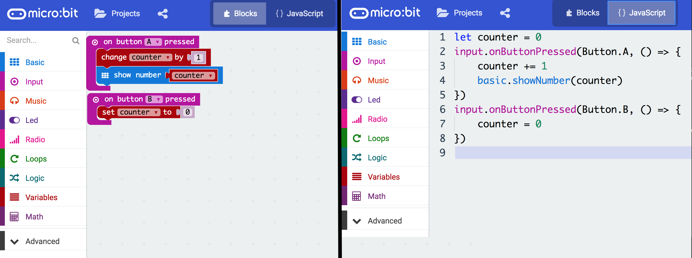

footer: [UoN CS4S Introduction 2019 Workshop](http://cs4s.github.io/intro-2019)

# From Blocks to Text Coding

## Coding & STEM 4 Schools

### An Introduction to Coding and Computational Thinking

#### Presented by Mr Daniel Hickmott

###### October 11th 2019

---

# Session Overview

- Yesterday, you:
	- Learned about *Coding* and *Computational Thinking*
	- Did some *Unplugged* activities and some *Blocks* Coding (with [Scratch](https://	scratch.mit.edu/))
	- Learned about important some **Computational Concepts:** *Sequences*, *Loops*, *Events* and *Parallelism*
- Today you will learn about how to apply these concepts in *Hybrid Coding Environments*

---
 
# Session Overview

- In this session, you will learn about: 
    - the differences between *Blocks*, *Hybrid* and *Text Coding environments*
    - examples of different *Blocks*, *Hybrid* and *Text* environments
    - how *Hybrid* coding environments could help your students 'transition' from *Blocks* to *Text* Coding[^1]

[^1]: [http://www.terpconnect.umd.edu/~weintrop/papers/Weintrop&Wilensky\_2019\_C&E.pdf](http://www.terpconnect.umd.edu/~weintrop/papers/Weintrop&Wilensky_2019_C&E.pdf)

---

# Session Overview

- After a presentation about the different environments, you will complete an activity with [PencilCode](http://pencilcode.net/)
- [PencilCode](http://pencilcode.net/) is a *Hybrid Coding Environment*
- We will use Math + Coding to draw patterns and art
- You will apply these **Computational Concepts** you learned about yesterday: *Sequences* and *Loops*
- You will also learn about *Operators* (another **Computational Concept**)

---

# Syllabus Outcomes (in 2019 Syllabuses)

- New Technology Mandatory (7-8) Syllabus:
	- *TE4-4DP:* designs *algorithms* for digital solutions and implements them in a *general-purpose programming language*
- New Science & Technology K-6 Syllabus:
	- *ST3-3DP-T:* defines problems, and designs, modifies and follows *algorithms* to develop solutions

---

# Visual vs General-Purpose Programming Languages

- *Visual Programming languages* (*Blocks*) usually:
    - utilise graphical elements (for example, puzzle pieces) to write programs
    - involve dragging and dropping blocks but there are some exceptions (for example, flowcharts)
- *General-Purpose Programming languages* (*Text*) are usually written using text only

---

```c
#include<stdio.h>

main()
{
    printf("Hello World");
}
```


---

# Blocks vs Text: Blocks

- *Blocks Coding* is popular in K-12 and also used for teaching Coding in some [Universities](http://cs10.org/su18/)
- *Blocks languages* are not usually used by professional Engineers and Scientists
- Very popular and a lot of current development and research work is being done to create and improve *Blocks languages*
- *Scratch*, *Snap! (Build Your Own Blocks)*, *LEGO Mindstorms*... you may use others with your students

---

```python

if __name__ == "__main__":
	total = 0
	i = -1
	numbers = [1,2,3,4
	for i in range(0, len(numbers)):
	   i = i + 1
		n = numbers[i]
	total = total + n
	print(total)	

```


---

# Blocks vs Text: Text

- Unlike *Blocks languages*, you have to be more careful about typos and syntax when Coding in *Text languages*
- These languages are used by professional Engineers and Scientists in industry and research  
- Used to develop the majority of software and apps
- *Java*, *Python*, *C++*, *Swift*… the list goes on

---

# Blocks vs Text: Why Blocks?

- No syntax or spelling errors
- Lower cognitive load
- Students can focus on *Computational Thinking*
- Can see all the functions in one place
	- [Scratch blocks](https://scratch.mit.edu/create)
	- [Python API documentation](https://docs.python.org/3/library/index.html)

---

# Blocks vs Text: Why Blocks?

- Not just for kids!
- [Scratch](https://scratch.mit.edu/) is used for 2 weeks of a [Computer Science course at Harvard](https://www.youtube.com/watch?v=o4SGkB_8fFs)
- [Unreal Blueprints](https://docs.unrealengine.com/latest/INT/Engine/Blueprints/) can be used to code professional games
- [NetLogo](https://ccl.northwestern.edu/netlogo/) can be used for creating simulations for studying Science concepts at the High School and University level

---

# Blocks vs Text: Why Text?

- Some cases where *Text languages* may be necessary
- Creating a website with a database (e.g. a Facebook-like website)
- Doing some serious Statistics / Data Science, e.g. [R](https://www.r-project.org/)
- Coding some *Physical Computing* devices, like [Arduinos](https://www.arduino.cc/)
- Students may want to work in or study Coding after school

---

# Moving from Blocks to Text

- You may: 
	- have students that want to move to *Text languages*
	- want to teach a *Text language* for something a *Block language* cannot do
	- show students that *Text languages* can be approachable for beginners

---

# Hybrid Coding Environments

- Allow you to switch between *Blocks* and *Text*
- Could help as a "stepping stone" from *Blocks* to *Text*
- Some examples are:
	- [PencilCode](http://pencilcode.net/)
	- [Microsoft MakeCode](https://makecode.microbit.org/) (we will use this later)
	- [Code.org's AppLab](https://code.org/educate/applab)
	- [Trinket](https://trinket.io/)

---



---


---

# Using Hybrid Coding Environments

- Up until recently, there have mainly been *Blocks* and *Text environments* (not *Hybrid*) for teaching Coding
- Research on how K-12 students learn *Text Coding* (or how they move from *Blocks* to *Text*) is not extensive
- Some research on [PencilCode](http://pencilcode.net/) students highlighted that students would switch back to *Blocks* when they could not remember the text commands
- *Hybrid* environments could be useful for *differentiation*

---

# Introductory Text Languages

- Languages that make learning *Text Coding* simpler:
	- [jsLogo](http://www.calormen.com/jslogo/) (Logo)
	- [Khan Academy Programming](https://www.khanacademy.org/computing/computer-programming) (JavaScript)
	- [Sonic Pi](http://sonic-pi.net/) (Ruby)
	- [Processing](https://processing.org/) (Java, Python or JavaScript)
- Could be useful for introducing *Text* languages in the context of creating multimedia: music, images and animations

