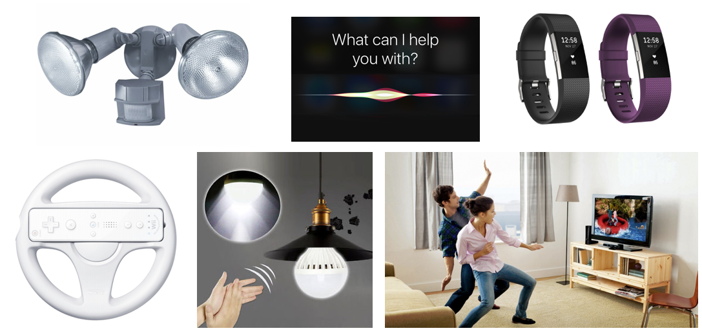
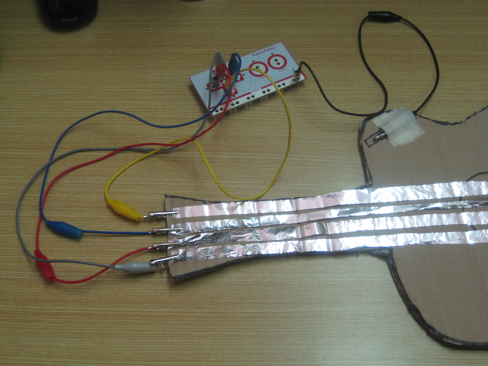
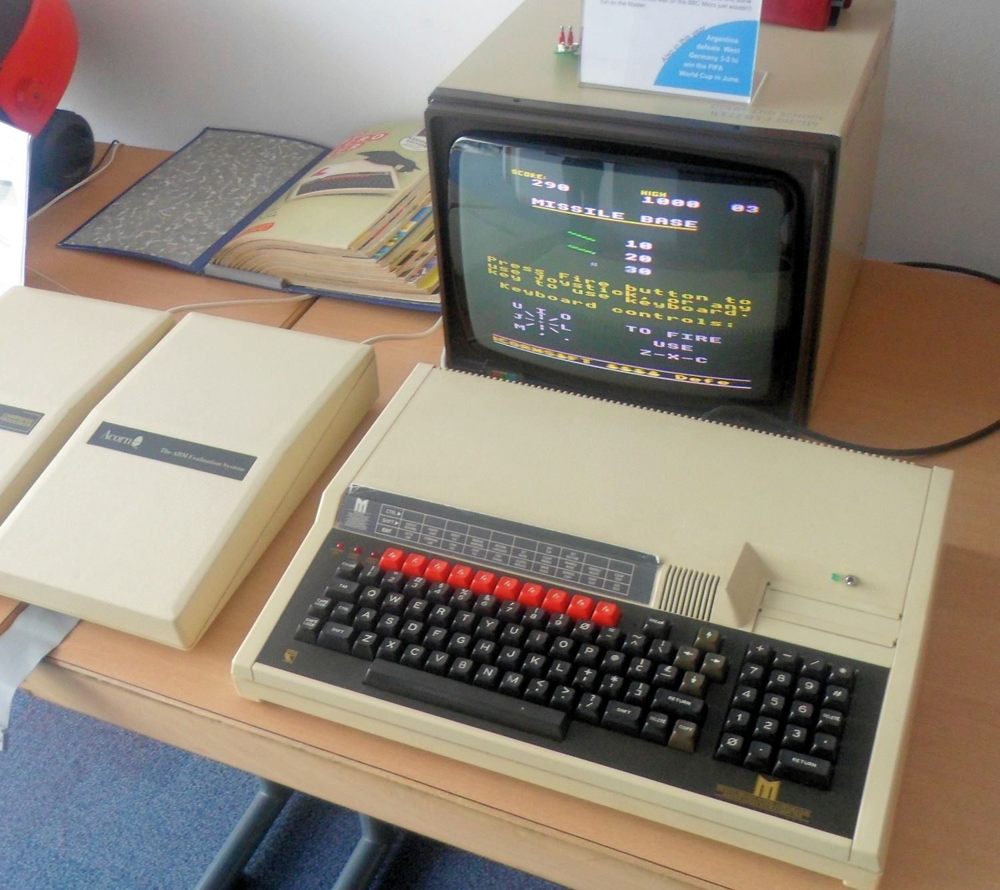
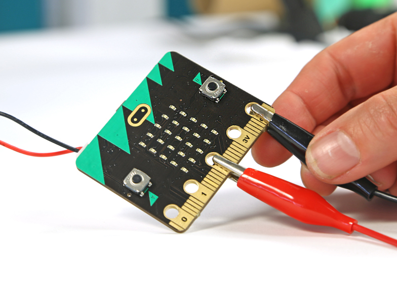
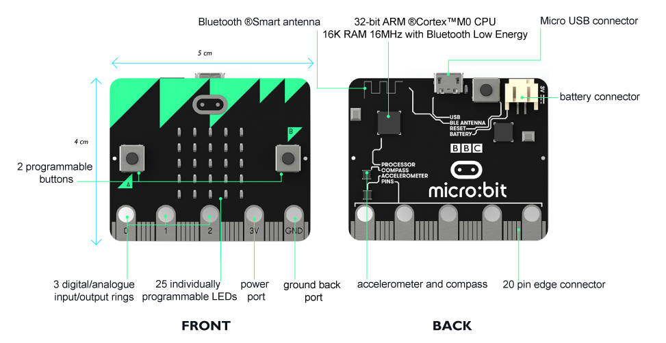

footer: [UoN CS4S Introduction 2019 Workshop](http://cs4s.github.io/intro-2019)

# Physical Computing with BBC Micro:bits

## Coding & STEM 4 Schools

### An Introduction to Coding and Computational Thinking

#### Presented by Mr Daniel Hickmott

###### October 11th 2019

---

# Physical Computing

*"Physical Computing is an approach to computer-human interaction design that starts by considering how humans express themselves physically… In physical computing, we take the human body and its capabilities as the starting point, and attempt to design interfaces, both software and hardware, that can sense and respond to what humans can physically do."*

- [Tom Igoe (2014)](https://itp.nyu.edu/physcomp/)

---
# What is Physical Computing?

---
# What is Physical Computing?

---

# NSW Science & Technology K-6 Syllabus

- Stage 2:
	- Students identify and explore a range of digital systems and *peripheral devices* (ACTDIK007)

- Stage 3:
	- Students design a *user interface* for a digital system, for example: (ACTDIP018) 
	- explore how the main components of digital systems *connect together* to form networks that transmit data (ACTDIK014)

---

# Physical Computing in K-6

- [Scratch + Video Sensing](https://www.youtube.com/watch?v=h_1YafmZD4c)
- [Scratch + Makey Makeys](https://www.youtube.com/watch?v=ntBSwn_8wno)
- [Microbits](https://www.youtube.com/watch?v=Wuza5WXiMkc)
- Well suited to *STEAM* projects (*S*cience, *T*echnology, *E*ngineering, *A*rts and *M*athematics)

---

 

*S*cience, *T*echnology, *E*ngineering, *A*rts and *M*athematics[^ ] 

[^ ]: [https://arraywhiz52446.wordpress.com/2015/05/28/k-2-makey-makey-project-part-i/](https://arraywhiz52446.wordpress.com/2015/05/28/k-2-makey-makey-project-part-i/)

---

# Science and Technology Outcomes

- **ST3-1WS-S:** plans and conducts scientific investigations to answer testable questions, and collects and summarises data to communicate conclusions
    - You can collect data with *Micro:bits'* sensors
- **ST3-3DP-T:** defines problems, and designs, modifies and follows algorithms to develop solutions
    - You will develop *digital solutions* in *MakeCode*

---

# Science and Technology Outcomes

- **ST3-2DP-T:** plans and uses materials, tools and equipment to develop solutions for a need or opportunity
    - *Micro:bits* projects combine *hardware* and *software*
- **ST3-11DI-T:** explains how digital systems represent data, connect together to form networks and transmit data
    - *Micro:bits* can be connected to other *Micro:bits* and data can be transmitted between them

---

# NSW Technology Mandatory Syllabus (7-8)

- Digital Technologies:
	- design the *user experience* of a digital solution, generating, evaluating and communicating alternative ideas (ACTDEP036, ACTDIP028, ACTDIP032)  
- collect and access data from a range of sources, for example: (ACTDIP025) 
	- using *sensors* to collect temperature data

---

# NSW Technology Mandatory Syllabus (7-8)

- implement and modify programs involving branching, iteration and functions in a general-purpose programming language, for example: (ACTDIP030)
	- *microcontroller*
- implement a functioning *user interface*, for example: (ACTDIP030) 
	- indicator LEDs on a *microcontroller*

---

# Physical Computing Across the Curriculum

- ICT Capability presents opportunities in different subjects:
	- Remote temperature monitor in *Science*
	- Creating an interactive sculpture in *Visual Arts*
	- Step-counter in *PDHPE*
	- A clicker counter or protractor in *Mathematics*
	- A compass in *Geography*
	- Making a piano in *Music*

---

# The BBC Micro [^  ]

 

[^  ]: [https://www.retromobe.com/2016/05/acorn-bbc-master-1986.html](https://www.retromobe.com/2016/05/acorn-bbc-master-1986.html)

---

# The BBC Micro:bit [^   ]

[^   ]: [Deezen: One Million UK Children to get Free BBC Micro Bit](https://www.dezeen.com/2015/07/10/one-million-uk-children-to-get-free-bbc-micro-bit-technology-will-save-us/)

---

# Why Micro:bit?

- Relatively cheap (around $20-30 each)
- Lots of resources available suitable for K-6 (likely due to English schools having access to them)
- You can just need the *Micro:bit*, a Computer and an internet connection (no need to install extra software)
- Has sensors, buttons, bluetooth & an LED display, which similarly priced devices often don't have
- Can be used as a controller in *Scratch 3* via bluetooth

---

# Micro:bit Components [^    ]

[^    ]: [http://microbit.org/guide/features/](http://microbit.org/guide/features/)

---

# Micro:bit Safety

- Put micro:bit back in the anti-static bag after use
- It's good practice to earth yourself before handling the device (by touching something metal)
- Only handle the micro:bit by its edges and avoid touching the components when the power is running
- Let us know if the micro:bit is or becomes damaged
- Further safety advice can be found [here](http://microbit.org/guide/safety-advice/)

---

# Microsoft MakeCode

- [MakeCode](https://makecode.microbit.org/) is one way to put Code onto *Micro:bits*
- An example of a *Hybrid Coding Environment* (combines *Blocks* and *Text*)
- You download a *.hex* file that has all of the Code
- The *Micro:bit* looks like a USB stick when plugged in
- You then copy the *.hex* file into the *Micro:bit* and it runs that Code

--- 

# Micro:bit Activities

- Activity 1: Interactive Badge (20 minutes)
- Activity 2: Using Various Inputs and Outputs (40 minutes)

---

# Discussion

- What *Computational Concepts* did you apply when creating the programs for the *Micro:bits*?
- Did you try any of the *Micro:bit Extension Activities*?
- Was [MakeCode](https://makecode.microbit.org/) different to Scratch? How so?
- Is there similarities between [MakeCode](https://makecode.microbit.org/) and Scratch?
- If you have tried other *Physical Computing* devices, how do they compare to *Micro:bits*?